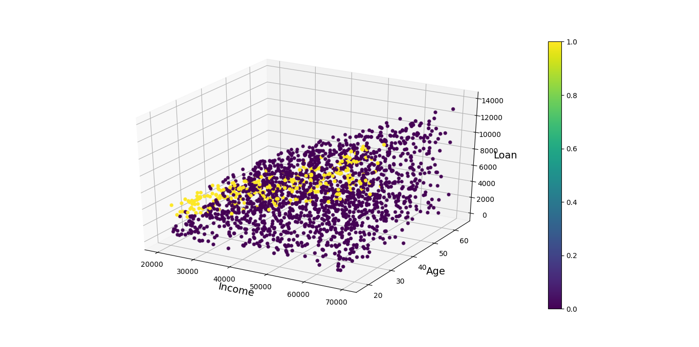
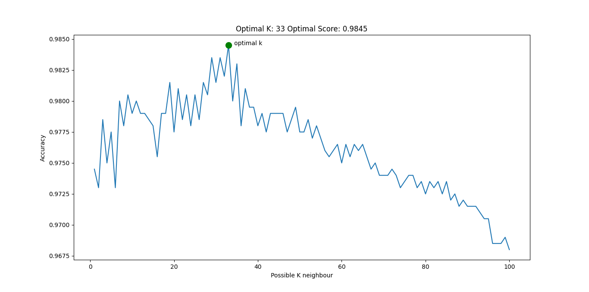
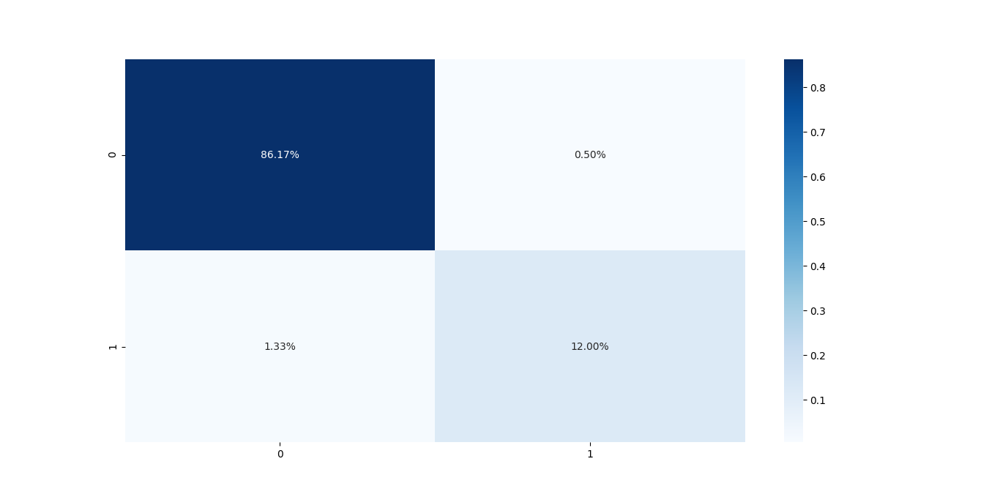
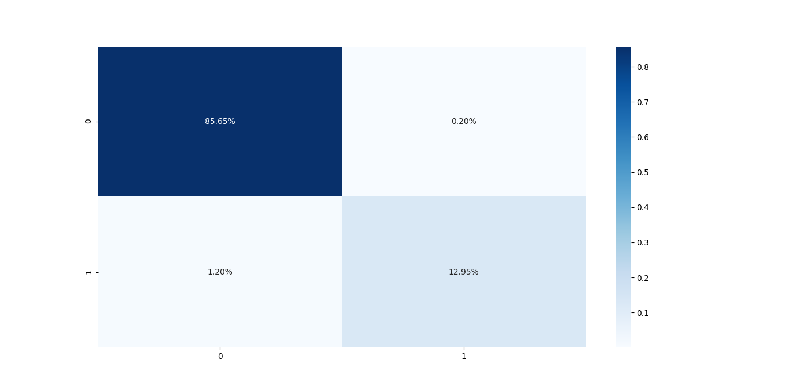

```text
.
├── api_test.py
├── app.py
├── data
│   └── credit_data.csv
├── docker-compose.yml
├── Dockerfile
├── figures
│   ├── Figure_cm_cv_.png
│   ├── Figure_cm_split_.png
│   ├── Figure_cv_2.png
│   ├── Figure_data.png
│   └── Figure_opt_k.png
├── README.md
├── requirements.txt
├── run.py
├── utils
│   ├── data.py
│   ├── __init__.py
│   ├── model.py
│   └── plot.py
└── weights
    ├── knn-09x1z.pkl
    ├── knn-2elfk.pkl
    ├── knn-l0ntr.pkl
    └── knn-q1ytl.pkl

4 directories, 21 files
```
```text
usage: run.py [-h] [--load LOAD] [--method {split,cv}]

optional arguments:
  -h, --help           show this help message and exit
  --load LOAD          True: Load trained model False: Train model default:
                       False
  --method {split,cv}  Training methods: cv- Cross-Validation default 10-Fold
                       split- default 70 perc train, 30 perc test
```


# Plot data
### Features: Income, Age, Loan 
### Labels: Default or not



```text
Note: Data is very inbalance
```


# Train the KNeighborsClassifier model 

### Find optimal K with with Cross-Validation



### Train Test Split method
```shell
python run.py --load no --method split
```
#### Confusion Matrix


#### Accuracy Score:  0.982

```text
Do you want to save the model weight? yes
Model saved at weights/knn-kse8k.pkl
```

### Cross-Validation method
```shell
python run.py --load no --method cv
```
#### Confusion Matrix


#### Accuracy Score:  0.986
```text
Do you want to save the model weight? yes
Model saved at weights/LogReg-n1u9q.pkl
```

# Load the trained model
```shell
python run.py --load yes
```

# Docker for the KNeighborsClassifier model

## Build Docker image
You can build docker image by following:

```shell script
docker-compose build
```

## Run Docker container

You can launch a container from the Docker image by following:

```shell script
docker-compose up
```